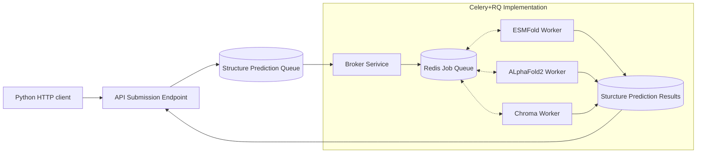

# Head-to-head-to-head in structure prediction.  
My work on making comparing different sequence to structure models an afterthought. 

## Background

Computational Biology is wild these days. It seems like every week there's a new tool or github paper that changes everything for a week until the next release. This is a big problem for a business trying to productionize Protein Design. 

If you spend a month working on productionizing AlphaFold2 but then MIT post-docs make something better there is a large psychological and technical barrier to migrating the system over. 

How do we solve this issue? Inference interfaces and inference as a service.

 Now when a new sexy model comes out, all you need to do is wrap it in code that converts your input type into its output type and turns its output type into yours. Basically I'm talking about the adapter pattern, nothing new. 

This is great in theory but runs into some challenges in practice. 

First, if you over apply your generalization your common interface may not support the nice features of all the tools you add to the eco system. Alternatively you may expand the interface to the point where it becomes unwieldy, with every possible setting for every possible model exposed.  

Second, all this code needs to live and run somewhere. Oftentimes that somewhere is in a compute cluster running dockerized jobs.  You also need to be able to incorporate this code into your existing environment stack which can be very challenging if you can't commit the resources to keep these tools updated as your internal codebase changes. 

All of these factors led to a spike on a project called the Structure Prediction Service(SPS). 
My company, Generate Biomedicines, developed a stable diffusion protein generation model called [Chroma]( https://github.com/generatebio/chroma).
One of the inference heads of this model allowed us to go from sequence to structure.

But wait! There are already a ton of sequences to structure models!!  Just to name a few: AlphaFold2-3, Boltz, Boltzgen,ESMFold, PRISM. All of these say they do the same thing and could be used to either validate the output of Chroma or, if they perform better than Chroma, should be used in our protein generation pipelines! 

One big problem… How can you deploy all these different stacks? How can you benchmark their performance? How can run these at scale so that you can do hyper parameter sweeps/ large scale production inference for these models? 

## Architecture

This was a huge project spanning multiple contributors. We had a big joint engineering meeting where we decided on the currency that all these models transact with.  

As input we would use a (protein sequence + model configuration + which model they were targeting).
As output we would use a (.cif) file, standard for describing protein structure, or series of (.cif)s. We would also need to dockerize all of these services and then use a single endpoint to submit jobs. Inputs would be saved and cached to reduce collisions and we would dynamically provision computers for this work. Then common simple HTTP clients could be written to submit work to these endpoints. 

I was given the task of designing/implementing a beta version of the job submission platform. 
Here is a rough approximation of what that looks like. 

I decided that I wanted a model that could support multiple queueing backends because this implementation might not be perfect. 

I settled on a few core technologies to support this: 

- FastAPI: A super lightweight python framework for deploying RESTful APIs. 
- Redis: An in memory database that is very quick. 
- RQ: An extension for Redis that supports Queued job definitions. 
- Celery: A framework for creating Workers and Brokers for a job queue. 
- S3: A remote file system(simplification) hosted by AWS. 
- Kubernetes(K8s): A cloud computing framework for deploying services across multiple computers. 
- Helm: A K8s templating framework that allows programmatic deployment of K8s services.
- ArgoCD: A CD platform with a UI for managing Helm Deployments. 

Additionally our K8s cluster was already configured with a tool called Karpenter which supports node packing and cluster autoscaling. This basically allows you to add computers to you compute cluster on demand! 

To bring SPS together I spun up a FastAPI submission endpoint and a redis job queue. This was then subscribed to by a standard RQ + Celery deployment. 
For each type of inferences(Alphafold,Chroma,ESM) I had a celery worker running on a docker container.Another team member implemented  the dockerized version for each specific tool. 
Finally all results would be written to an S3 bucket and could be referred to by the FastAPI.
Job state was managed in that first layer of redis queue with the broker service polling the status of different Celery jobs.  I finally created helm charts for all of these services and deployed them in K8s with an ArogCD. 

After the initial implementation for this service We found that we wanted to dynamically control the compute scale of the cluster. To do this I added an additional endpoint to the broker service api that would let the broker service spin up additional max workers upon request. This state was held in the same redis queue running RQ. 

The scale that this simple system was able to achieve was really encouraging. At its height we were able to process over 100k predictions simultaneously(~10k concurrent workers).  After this initial implementation the project was handed off but I continued to provide support. We added a caching layer for sequences that was written in postgres and we migrated the backend to use AWS batch and then later Volcano to support using a fixed compute cluster. I got to help design the Caching Schema and work to support the clients we implemented for our production inference pipeline for new protein therapies. 

This whole project took us 2 weeks to start getting results. Coming out of this I was really impressed by how well these off the shelf components work together and how much value we were able to add to our scientific research ability by making these easily accessible! 

# Skills
During this project I used the following skill areas:
- Python
- Docker
- Redis
- Helm 
- K8s
- Celery
- RQ 
- AlphaFold2
- AWS S3
- FastAPI 
- AWS RDS Postgres 
